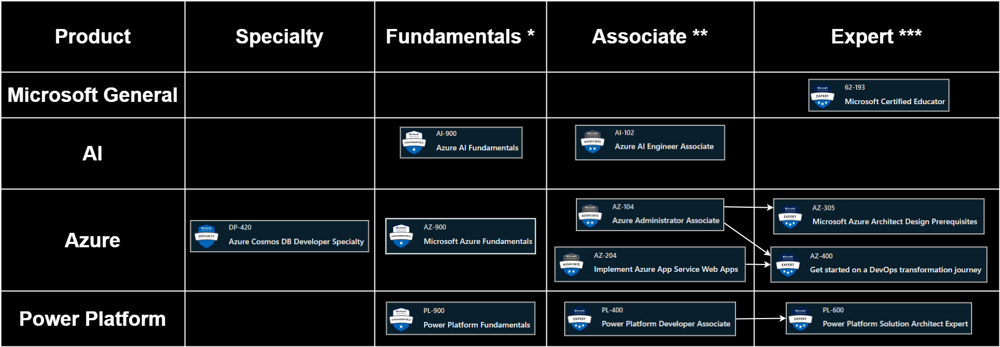

# Azure Certification

## ***AZ-900 * - Azure Fundamentals***

- [Certification](https://learn.microsoft.com/en-us/certifications/azure-fundamentals)
- [Exams](https://learn.microsoft.com/en-us/certifications/exams/az-900)
- [Study Guide](https://learn.microsoft.com/en-us/certifications/resources/study-guides/AZ-900)
- [Pluralsight](https://app.pluralsight.com/paths/certificate/az-900-microsoft-azure-fundamentals)
- [My Certificate](https://learn.microsoft.com/api/credentials/share/en-us/GlenSouza/D9ECFA715A9946FD?sharingId=670D3D659176C7C3)

## AZ-104 - Azure Administrator Associate

- [Certification](https://learn.microsoft.com/en-us/certifications/azure-administrator)
- [Exams](https://learn.microsoft.com/en-us/certifications/exams/az-104)
- [Pluralsight](https://app.pluralsight.com/library/courses/az-104-microsoft-azure-adminstrator-certification-prep/table-of-contents)

## AZ-104 ** - Azure Administrator Associate

Pre-requisites: AZ-900

- [Certification](https://learn.microsoft.com/en-us/certifications/azure-administrator)
- [Exams](https://learn.microsoft.com/en-us/certifications/exams/az-104)
- [Pluralsight](https://app.pluralsight.com/paths/certificate/azure-administrator-az-104)

## AZ-204 ** - Azure Developer Associate (*8/16*)

Pre-requisites: AZ-900

- [Certification](https://learn.microsoft.com/en-us/certifications/azure-developer)
- [Exams](https://learn.microsoft.com/en-us/certifications/exams/az-204)
- [Pluralsight](https://app.pluralsight.com/paths/certificate/developing-solutions-for-microsoft-azure-az-204)

## AZ-305 *** - Azure Solutions Architect Expert

Pre-requisites: AZ-104

- [Certification](https://learn.microsoft.com/en-us/certifications/azure-solutions-architect)
- [Exams](https://learn.microsoft.com/en-us/certifications/exams/az-305)
- [Pluralsight](https://app.pluralsight.com/paths/certificate/az-305-designing-microsoft-azure-infrastructure-solutions)

## AZ-400 *** - DevOps Engineer Expert

Pre-requisites: AZ-204

- [Certification](https://learn.microsoft.com/en-us/certifications/devops-engineer)
- [Exams](https://learn.microsoft.com/en-us/certifications/exams/az-400)
- [Pluralsight](https://app.pluralsight.com/paths/certificate/az-400-designing-and-implementing-microsoft-devops-solutions)

## GitHub

- [GitHub Skills](https://skills.github.com)
- [GitHub Actions](https://learn.microsoft.com/en-us/users/githubtraining/collections/n5p4a5z7keznp5)
- [GitHub Advanced Security](https://learn.microsoft.com/en-us/users/githubtraining/collections/rqymc6yw8q5rey)
- [GitHub Administration](https://learn.microsoft.com/en-us/users/githubtraining/collections/mom7u1gzjdxw03)

## Other resources

- [Microsoft Learn MCID](https://learn.microsoft.com/en-us/users/glensouza)
- [Practice Tests](https://teams.measureup.com/teams/tests/student)
- [Pearson | Vue = Testing](https://home.pearsonvue.com/microsoft)
